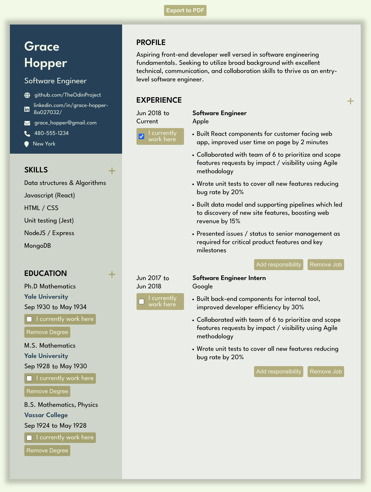

# CV Application

Application that allows a user to create a CV. User can upload a photo, edit and save input fields, and export their CV as a PDF. Multiple education and experience fields can be added on.

-> <a href="https://sumedh-inamdar.github.io/cv-application/">link to page</a> <-

## Lessons learned

- ReactJS library:
  - Class components
  - States and props
  - Conditional rendering
  - Event Listeners

## To do list

## Bugs to fix

- [ ] Trash icon does not disappear after editing skill

## Future work
